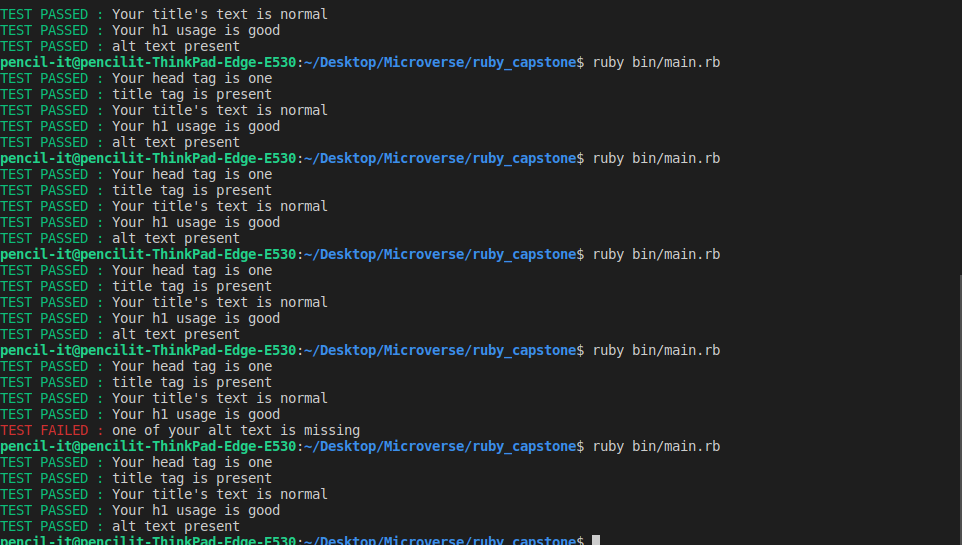

# Html Checker
This is a basic Html checker that checks Html codes if you properly used the tags or not and also corroborate good SEO practice.

 ## How it works
 This linter forces users on the proper usage of html elements and also exposes them to good exposes them to basics of SEO.

 - The Linter checks if the head tag is present
 - It checks whether the codes have a title
 - It checks if the title's character is within the required length
 - It checks if the image tag has an attribute of alt.
 - It checks the number of h1 in the code, which is recommended to be one only
 

 

 ## Examples
 Below is an the code of a bad SEO HTML tag
 - index.html

 
- Linter output

## Built With

- Ruby

## How to run Linter

- Clone the repo on your local machine
- Cd into the folder
- Add Nokogiri gem to your machine if you don't have it by typing 'gem install nokogiri'
- Run this command line: ruby bin/main.rb

## How to run Test
-after cloning the repo on your local machine
-make sure you have rspec installed on your machine
- type 'rspec' to test it

## Video description of the project
<a href="https://www.loom.com/share/13fa9ff1aa6a4ff7bcfb614570a50444">click here to watch the video</a>

## Requirements
- Ruby
- Colorize
- Nokogiri

👤 **Arafat Akata**

- Github: [@haraphat01](https://github.com/haraphat01)
- Twitter: [@haraphat01](https://twitter.com/haraphat01)

## Show your support

Give a ⭐️ if you like this project!

## Acknowledgments

- Hat tip to <a href="https://microverse.org/">Microverse</a>
